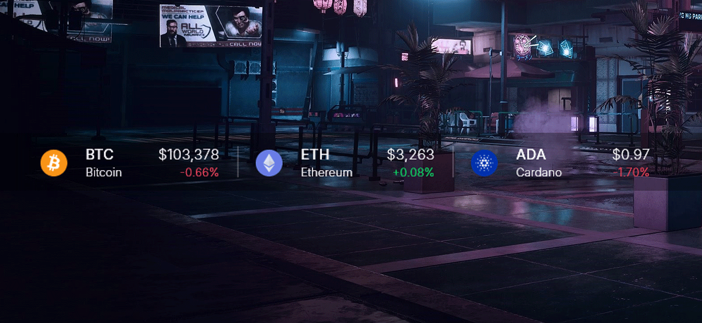
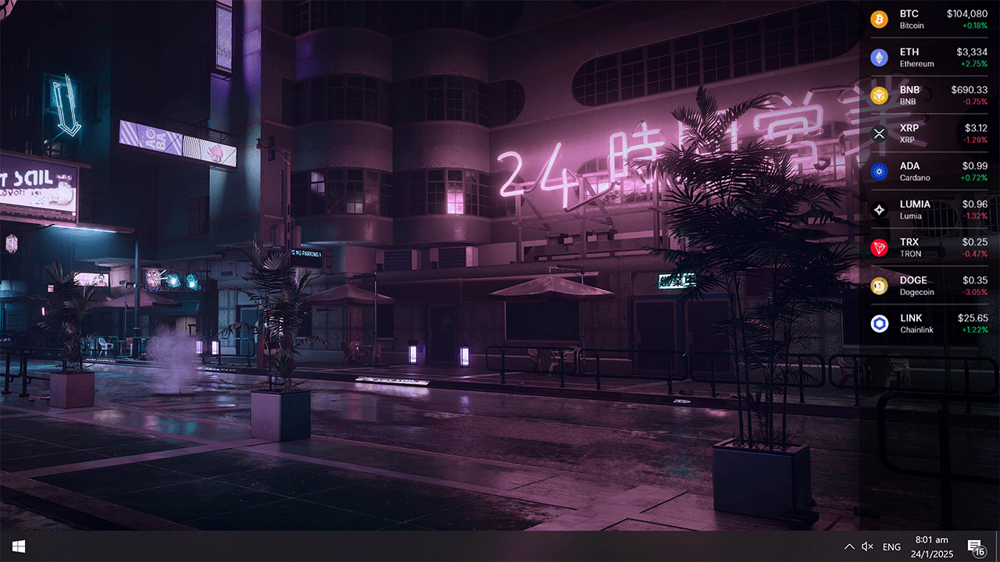
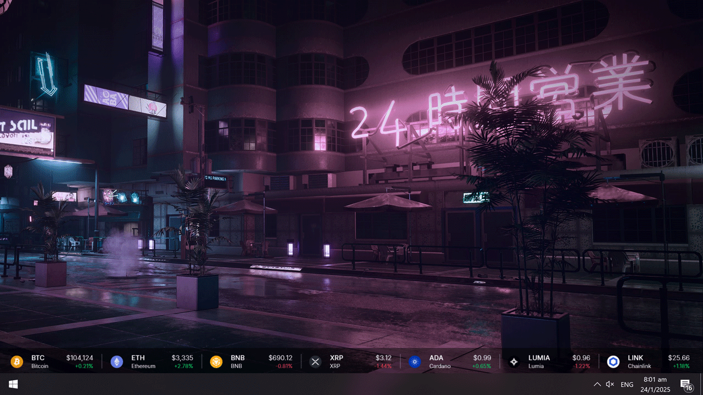

# Modular Crypto Dash

  

A simple rainmeter skin to track live crypto prices right on your desktop using the Binance API. This is my first Rainmeter widget, and it's still a work in progress.

 

## ⚡ Features

> Vertical Orientation
>
> 

> Horizontal Orientation
>
> 

- Track multiple cryptocurrencies with real-time price data from Binance.
- Modular design with customizable tokens.
- Adjustable background opacity, font settings, and token display.
- Easily configure the tokens you want to track via the variables file.
- Supports up to 9 tokens (or more) with custom settings for each token.
- Choose between Horizontal or Vertical orientation
- Pre-loaded with logos of Top 100 Cryptos

 

## 💡 Requirements

- [Rainmeter](https://www.rainmeter.net/) (version 4.5.20.3803 or higher)

 

## 🛠️ Installation

1. Download and install the latest version of [Rainmeter](https://www.rainmeter.net/).
2. Download the latest release of Modular Crypto Dash [here]().
3. Double-click the .rmskin file to install
4. To edit tokens info, navigate to the **@Resources** folder and edit the **variables.ini** file, or simply *right-click* any token and click **Edit Token Info** from the context menu.

 

## 💻 Configuration

The **variables.ini** file in the **@Resources** folder contains all the customizable settings for the skin. This includes:

- **Update Speed:** Controls how often the data is fetched from Binance's API.
- **Token Settings:** Set the tokens you want to track (e.g., BTC, ETH, XRP, etc.).
- **Font Settings:** Customize the font type, size, and color.
- **General Settings:** Adjust the skin’s background size, opacity, scale, etc.
- **Token Name Mapping**: If your token's full asset name is not mapped, you can add it to the token name mapping list in the variables.ini file.
- **Pre-loaded Token Data**: If your token's logo is not pre-loaded, you can add it to the @Resources/images/token logos folder it to show up.

If you're familiar with Rainmeter skins, you can also make adjustments in the token ini files.

 

# 🤝 Contributing

Contributions are what make the open source community such an amazing place to learn, inspire, and create. Any contributions you make are **greatly appreciated**.

If you have a suggestion that would make this better, please fork the repo and create a pull request. You can also simply open an issue with the tag "enhancement".
Don't forget to give the project a star! Thanks again!

 

# 📜 License

Distributed under the MIT License. See `LICENSE.txt` for more information.

 

# 🌟 Credits

- [Binance](https://www.binance.com/en/binance-api)
- [sysDash](https://github.com/marcopixel/SysDash)
- [Minimal Crypto Tracker](https://github.com/JacobA2000/Rainmeter-MinimalCryptoTracker)
- [Google Fonts](https://fonts.google.com/specimen/Inter)
- [Wallpaper](https://www.cyberpunk.net/us/en/)

 
 

[Back to top](#top)
